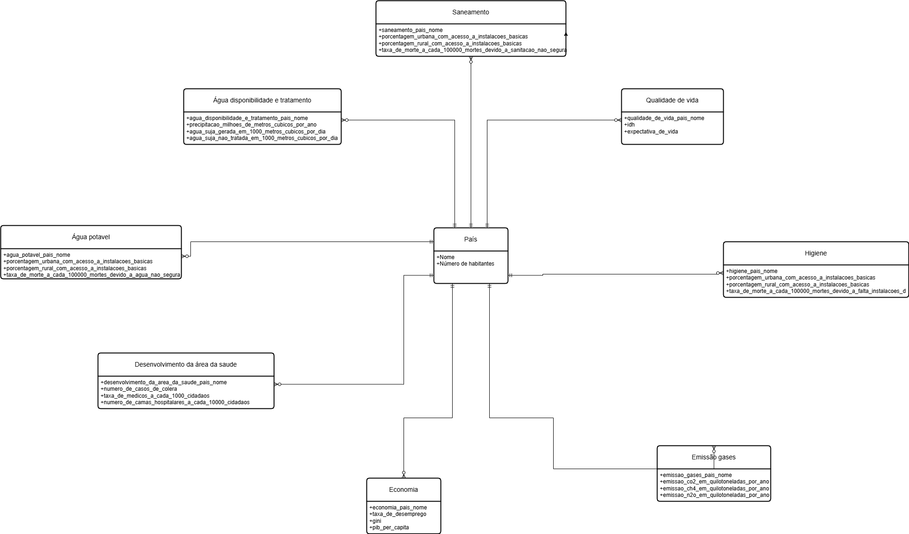
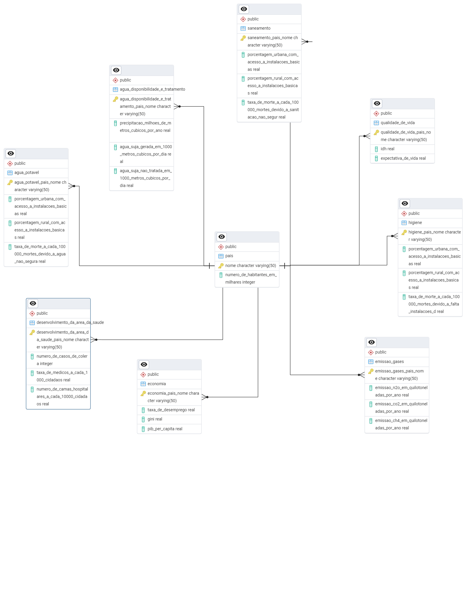
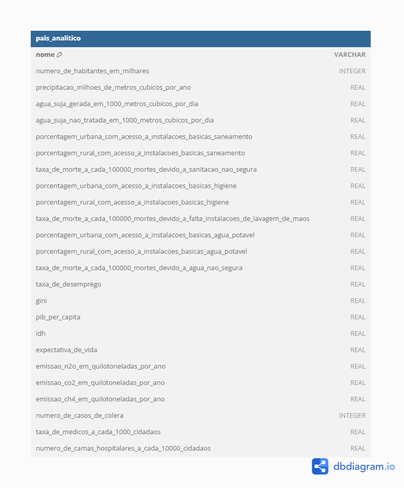

# Sistema de Análise de Indicadores Sanitários - MC536

## Descrição

Este projeto foi desenvolvido para fins educacionais na disciplina de Banco de Dados (MC536) na UNICAMP. Ele consiste na modelagem de um sistema de banco de dados relacional (PostgreSQL) voltado à análise integrada de informações sobre saneamento, saúde, economia, qualidade de vida e emissões por país. Esse banco será modelado também em não relacional, utilizando DuckDB. 

## Corpo do Projeto

### 1. Modelos Conceitual, Relacional e Lógico (noSQL)

<div align="center">
  
  <p><em>Figura 1: Modelo conceitual do banco de dados</em></p>
</div>

<br>

<div align="center">
  
  <p><em>Figura 2: Modelo relacional do banco de dados</em></p>
</div>

<br>

<div align="center">
  
  <p><em>Figura 3: Modelo lógico do banco de dados não relacional</em></p>
</div>

### 2. Implementação: Criação, População e Consultas SQL

O banco de dados foi criado no PostgreSQL, utilizando scripts para:
- Criação do modelo físico
- População da base
- Execução de consultas SQL

Para acessar o script e os códigos utilizados, clique aqui:  
[Criação e População do Banco PostgreSQL + Consultas SQL](criacao_e_populacao_bd.md)
[Criação e População do Banco DuckDB + Consultas SQL](duckdb_criacao_e_populacao_bd.md)
---

### 3. Estrutura do Repositório
```pgsql
MC536/
│
├── Consultas/
│   └── consultas.md
│
├── Datasets/
│   ├── DataUN/
│   │   ├── Desenvolvimento_da_Área_da_Saúde/
│   │   │   └── Fontes.txt
│   │   ├── Emissao_Gases/
│   │   │   └── Fontes.txt
│   │   ├── País/
│   │   │   └── Fontes.txt
│   │   ├── Água_Disponibilidade_e_Tratamento/
│   │   │   └── Fontes.txt
│   ├── OurWorldInData/
│   │   ├── Economia/
│   │   │   └── Fontes.txt
│   │   ├── Higiene/
│   │   │   └── Fontes.txt
│   │   ├── Qualidade_de_Vida/
│   │   │   └── Fontes.txt
│   │   ├── Sanitação/
│   │   │   └── Fontes.txt
│   │   ├── Água_potável/
│   │       └── Fontes.txt
├── Modelos/
│   ├── modelo_conceitual.png
│   ├── modelo_relacional.png
│   ├── modelo_relacional.pgerd
│   ├── modelo_fisico.sql
│   └── modelo_fisico_EDR_tool.sql
│
├── Resultados/
│   ├── consulta1.csv
│   ├── consulta2.csv
│   ├── consulta3.csv
│   ├── consulta4.csv
│   ├── consulta5.csv
│
└── criacao_e_populacao_bd.md
└── README.md
```
