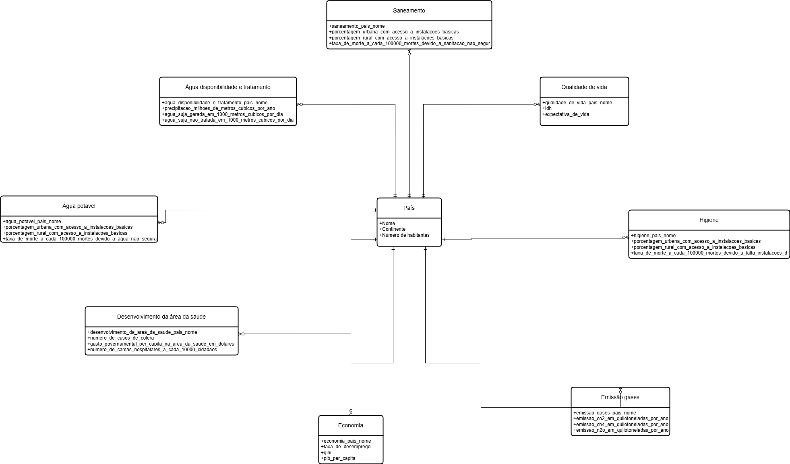
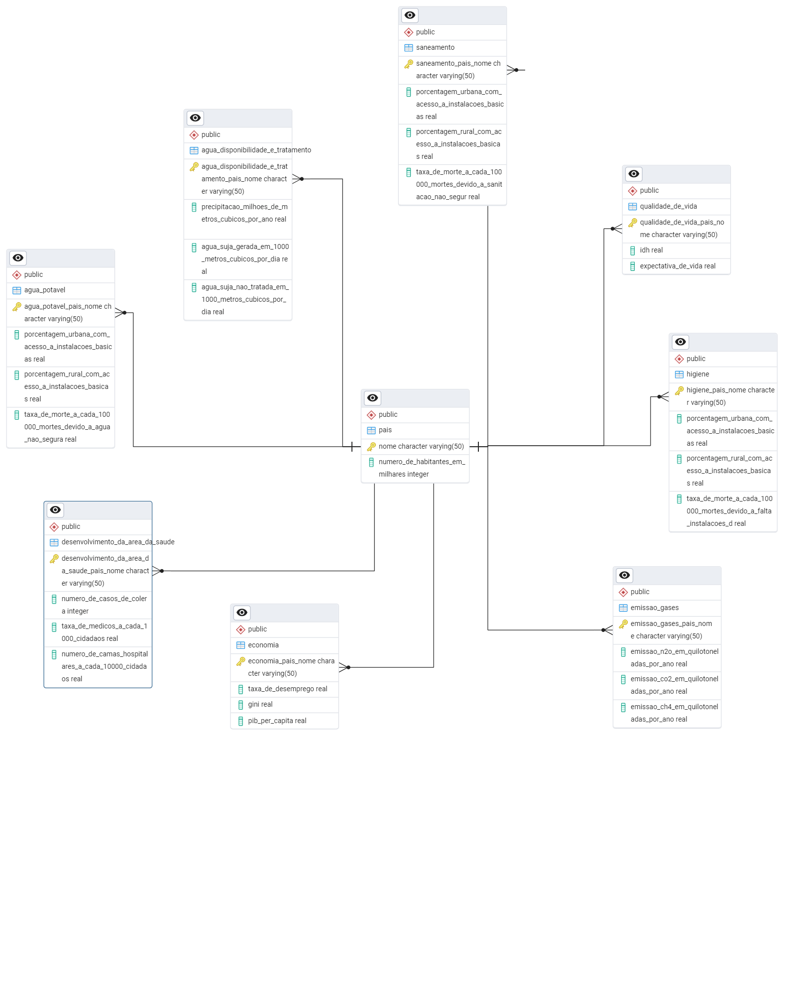

# Sistema de Análise de Indicadores Sanitários, Econômicos e Ambientais por País

## Descrição

Este projeto foi desenvolvido para fins educacionais na disciplina de Banco de Dados (MC536) na UNICAMP. Ele consiste na modelagem de um sistema de banco de dados relacional (PostgreSQL) voltado à análise integrada de informações sobre saneamento, saúde, economia, qualidade de vida e emissões por país.

## Corpo do Projeto

### 1. Modelos Conceitual e Relacional

Os modelos abaixo ilustram a estrutura lógica do banco de dados relacional, incluindo entidades como `saneamento`, `economia`, `qualidade_de_vida`, `higiene`, `água potável`, `emissão de gases`, entre outras, todas ligadas à entidade `país`.

  
  
<em>Figura 1: Modelo conceitual do banco de dados</em>

 

  
  
<em>Figura 2: Modelo relacional do banco de dados</em>

### 2. Implementação: Criação, População e Consultas SQL

O banco de dados foi criado no PostgreSQL, utilizando scripts para:
- Criação do modelo físico (DDL)
- População da base com dados reais
- Execução de consultas SQL não triviais (com agregações, junções e ordenações)

Acesse os scripts e códigos utilizados aqui:  
📄 [Criação e População do Banco + Consultas SQL](criacao_e_populacao_bd.md)

